# Kafka Authentication Mechanisms: PLAIN vs SCRAM-SHA-256

## Table of Contents
- [Overview](#overview)
- [PLAIN Authentication](#plain-authentication)
  - [Flow Diagram](#flow-diagram)
  - [Characteristics](#characteristics)
  - [Configuration Example](#configuration-example)
- [SCRAM-SHA-256 Authentication](#scram-sha-256-authentication)
  - [Flow Diagram](#flow-diagram-1)
  - [Characteristics](#characteristics-1)
  - [Configuration Example](#configuration-example-1)
- [Comparing PLAIN vs SCRAM: A Tale of Two Schools 🏫](#comparing-plain-vs-scram-a-tale-of-two-schools-)
  - [School A: Simple ID System (Like PLAIN)](#school-a-simple-id-system-like-plain)
  - [School B: Smart Card System (Like SCRAM)](#school-b-smart-card-system-like-scram)
  - [Compare and Contrast](#compare-and-contrast)
  - [Real-Life Examples](#real-life-examples)
  - [Why School B (SCRAM) is Safer](#why-school-b-scram-is-safer)
  - [When to Use Each System?](#when-to-use-each-system)
  - [Safety Tips for Parents](#safety-tips-for-parents)
- [Understanding SASL_PLAINTEXT: A School Cafeteria Story 🏫](#understanding-sasl_plaintext-a-school-cafeteria-story-)
  - [The Cafeteria Story](#the-cafeteria-story)
  - [Real-World Example: School Lunch System](#real-world-example-school-lunch-system)
  - [Comparison with Real Kafka](#comparison-with-real-kafka)
  - [Why It's Like This](#why-its-like-this)
  - [Safety Notes](#safety-notes)
- [Understanding SASL_PLAINTEXT Protocol](#understanding-sasl_plaintext-protocol)
  - [What is SASL_PLAINTEXT?](#what-is-sasl_plaintext)
- [Kafka Security Protocols Overview](#kafka-security-protocols-overview)
- [Protocol Comparison Table](#protocol-comparison-table)
- [Protocol Selection Guide](#protocol-selection-guide)
- [Performance Considerations](#performance-considerations)
- [Comparison Table](#comparison-table)
- [Best Practices](#best-practices)
- [Implementation Steps](#implementation-steps)
- [Monitoring and Troubleshooting](#monitoring-and-troubleshooting)

## Overview

This document explains the differences between two Kafka SASL authentication mechanisms: PLAIN and SCRAM-SHA-256.

## PLAIN Authentication

PLAIN is a simple authentication mechanism where credentials are sent in plain text.

### Flow Diagram

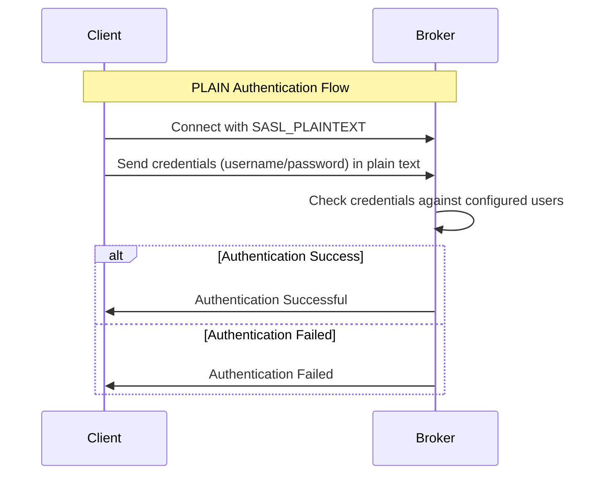

### Characteristics
- ⚠️ Credentials sent in plain text
- 🔧 Simple to configure
- 📝 Credentials stored in JAAS config
- 🔒 Should only be used with TLS encryption in production

### Configuration Example
```properties
# Server JAAS Config
org.apache.kafka.common.security.plain.PlainLoginModule required
    username="admin"
    password="admin-secret"
    user_client1="client1-secret";

# Client Properties
security.protocol=SASL_PLAINTEXT
sasl.mechanism=PLAIN
sasl.jaas.config=org.apache.kafka.common.security.plain.PlainLoginModule required \
    username="client1" \
    password="client1-secret";
```

## SCRAM-SHA-256 Authentication

SCRAM (Salted Challenge Response Authentication Mechanism) is a more secure authentication method that uses challenge-response to avoid sending passwords in plain text.

### Flow Diagram

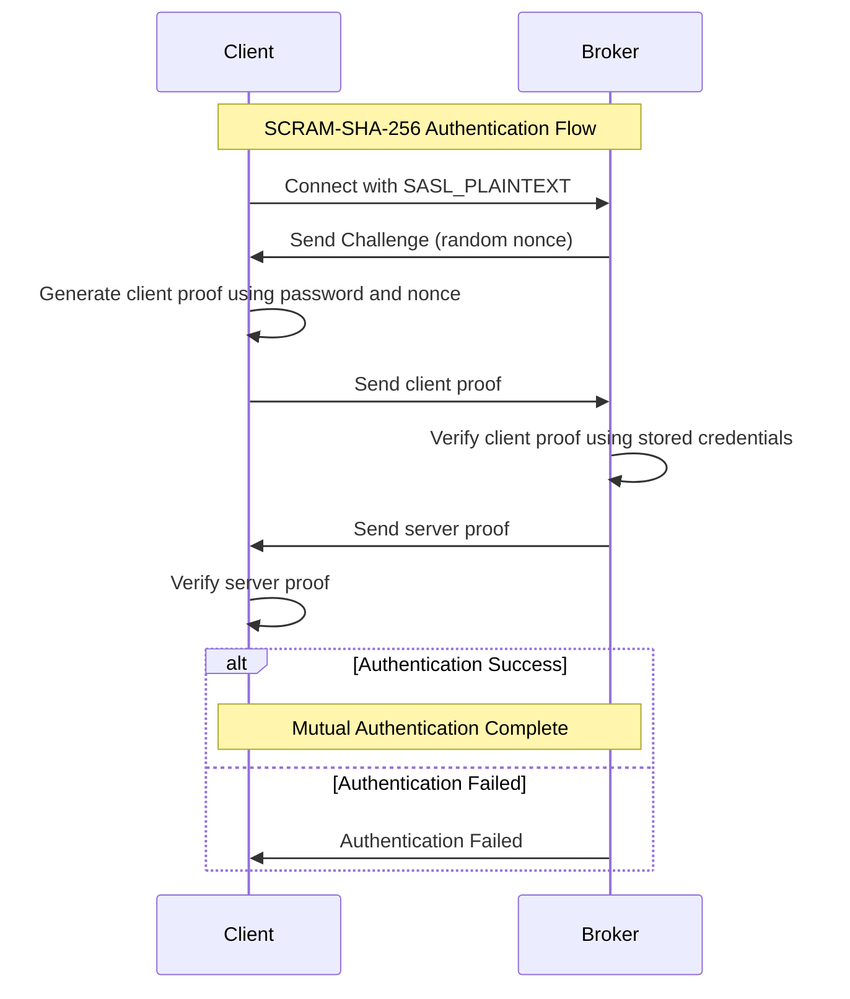

### Characteristics
- 🔒 Password never sent over network
- 🔄 Challenge-response mechanism
- 💪 Protection against replay attacks
- 🎯 Mutual authentication
- 📊 Supports password iteration for increased security

### Configuration Example
```properties
# Create SCRAM Credentials
kafka-configs.sh --bootstrap-server localhost:9092 \
    --alter --add-config 'SCRAM-SHA-256=[iterations=8192,password=client1-secret]' \
    --entity-type users --entity-name client1

# Client Properties
security.protocol=SASL_PLAINTEXT
sasl.mechanism=SCRAM-SHA-256
sasl.jaas.config=org.apache.kafka.common.security.scram.ScramLoginModule required \
    username="client1" \
    password="client1-secret";
```

## Comparing PLAIN vs SCRAM: A Tale of Two Schools 🏫

Let's compare two different schools and their lunch systems to understand PLAIN and SCRAM authentication:

#### School A: Simple ID System (Like PLAIN)
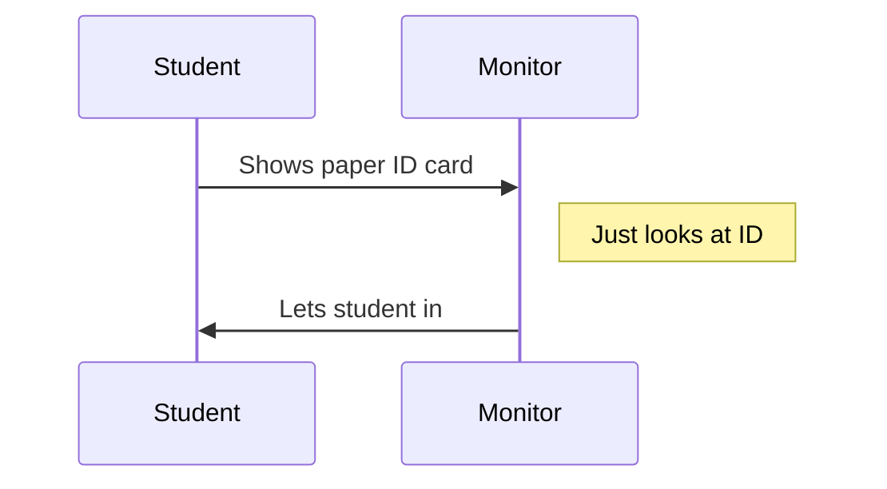

- **How it works:**
  - Students show a simple paper ID card
  - Hall monitor just looks at the ID
  - ID and name are shown in plain sight
  - Anyone could potentially copy the ID card

#### School B: Smart Card System (Like SCRAM)
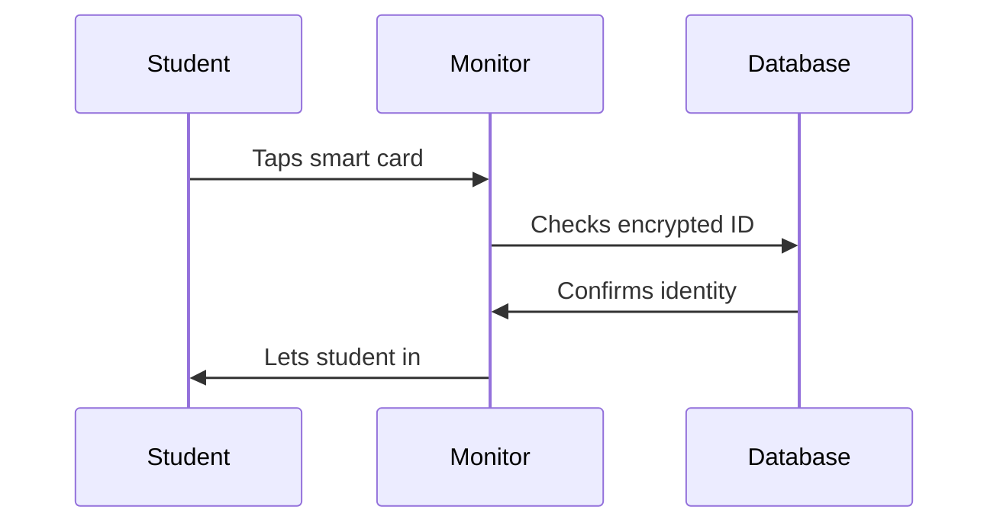

- **How it works:**
  - Students use special electronic smart cards
  - Card has a secret chip inside
  - Scanner checks with school database
  - Can't be easily copied

### Compare and Contrast

| Feature | School A (PLAIN) | School B (SCRAM) |
|---------|-----------------|------------------|
| ID Type | Paper card | Smart card with chip |
| Security | 😐 Basic | 😊 Strong |
| Can be copied? | Yes, easily | No, very hard |
| Checking process | Quick look | Electronic verification |
| Cost | Cheap | More expensive |

### Real-Life Examples

#### School A (PLAIN):
```
Student: "Here's my ID card!"
Monitor: "I see your name is Tom, go ahead!"
[Anyone watching can see Tom's ID]
```

#### School B (SCRAM):
```
Student: *taps smart card*
Monitor's Scanner: *beep* "Identity confirmed"
[No one can see the secret code inside]
```

### Why School B (SCRAM) is Safer

1. **Secret Storage**
   - School A: ID info visible to everyone
   - School B: Secret code hidden in chip

2. **Verification Process**
   - School A: Just visual checking
   - School B: Electronic verification with database

3. **Copy Protection**
   - School A: Can photocopy ID card
   - School B: Can't copy secret chip

### When to Use Each System?

#### Use School A System (PLAIN) when:
- It's a small, trusted school
- Everyone knows each other
- Budget is limited
- Speed is important

#### Use School B System (SCRAM) when:
- It's a big school
- Many unknown students
- Security is important
- Can afford better technology

### Safety Tips for Parents 👨‍👩‍👧‍👦

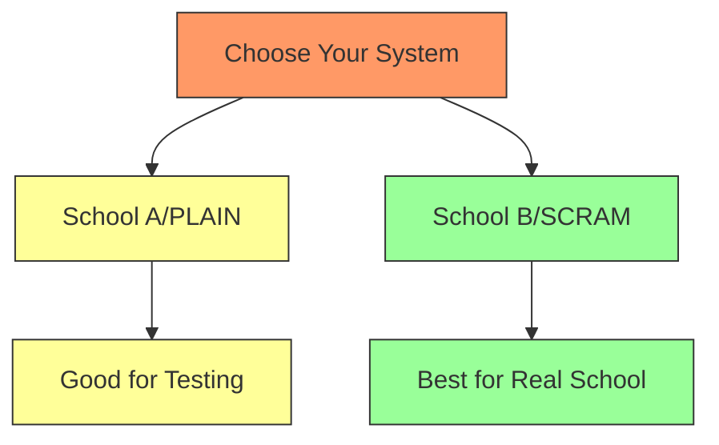

1. **For School Projects:**
   - School A system is okay
   - Like using PLAIN for testing

2. **For Real School:**
   - Always choose School B
   - Like using SCRAM in production

Remember: Just like you want your child's school ID to be secure, you want your Kafka messages to be safe too! 🔐

## Understanding SASL_PLAINTEXT: A School Cafeteria Story 🏫

Imagine a school cafeteria where students get their lunch. This is just like how Kafka works with SASL_PLAINTEXT!

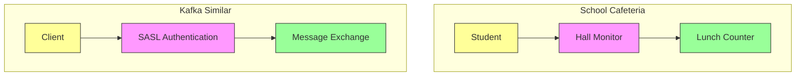

### The Cafeteria Story 📚

1. **Student ID Card (Like SASL Authentication)**
   ```mermaid
   sequenceDiagram
       participant S as Student
       participant M as Hall Monitor
       participant C as Cafeteria
       
       Note over S,C: Getting Lunch Process
       S->>M: Shows Student ID
       M->>M: Checks if ID is valid
       alt Valid ID
           M->>S: "Welcome! Go ahead"
           S->>C: Gets in line for food
       else Invalid ID
           M->>S: "Sorry, can't enter"
       end
   ```

   - Just like showing your student ID to the hall monitor
   - The hall monitor checks if you're really a student
   - Only students with valid IDs can enter

2. **Inside the Cafeteria (Like Message Exchange)**
   ```mermaid
   sequenceDiagram
       participant S as Student
       participant L as Lunch Lady
       
       Note over S,L: Getting Food
       S->>L: Asks for pizza
       L->>S: Gives pizza
       S->>L: Asks for juice
       L->>S: Gives juice
   ```

### Real-World Example: School Lunch System

#### The School Setup:
- **Student (Client)**
  - Has a student ID card
  - Wants to get lunch

- **Hall Monitor (SASL Authentication)**
  - Checks student IDs
  - Makes sure only real students enter

- **Lunch Counter (Kafka Broker)**
  - Serves food (messages)
  - Takes lunch orders (receives messages)

#### How It Works:

1. **Getting In (Authentication)**
   - Student: "Hi! Here's my ID card" (Client shows credentials)
   - Hall Monitor: "Let me check..." (SASL checks credentials)
   - Hall Monitor: "OK, you can go in!" (Authentication success)

2. **Getting Lunch (Message Exchange)**
   - Student: "I'd like pizza please" (Client sends message)
   - Lunch Lady: "Here's your pizza" (Broker handles message)

### Comparison with Real Kafka

| School Cafeteria | Kafka SASL_PLAINTEXT |
|------------------|---------------------|
| Student ID | Username/Password |
| Hall Monitor | SASL Authentication |
| Lunch Counter | Kafka Broker |
| Ordering Food | Sending Messages |
| Getting Food | Receiving Messages |

### Why It's Like This

1. **Just Like School Rules**:
   - School: Need ID to enter cafeteria
   - Kafka: Need credentials to connect

2. **Inside is Safe**:
   - School: Once inside, you can freely get your food
   - Kafka: Once authenticated, you can send/receive messages

3. **Different Roles**:
   - School: Some students can only get lunch, others can help serve
   - Kafka: Some clients can only read, others can write too

### Safety Notes (For Parents and Teachers)

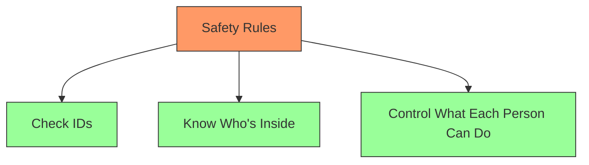

1. **Like School Security**:
   - Always check IDs
   - Know who's in the cafeteria
   - Make sure students only do what they're allowed to

2. **Like Kafka Security**:
   - Always check credentials
   - Track who's connected
   - Control read/write permissions

Remember: Just like you need your student ID to get lunch at school, Kafka clients need their credentials to send and receive messages! 🎓

## Understanding SASL_PLAINTEXT Protocol

### What is SASL_PLAINTEXT?

SASL_PLAINTEXT is a security protocol that combines:
- SASL (Simple Authentication and Security Layer) for authentication
- PLAINTEXT for data transmission

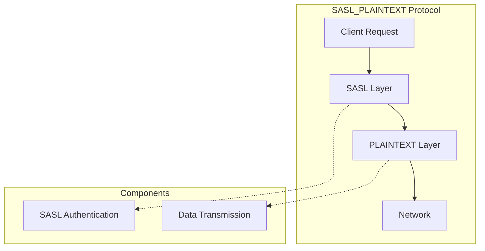

### Protocol Layers

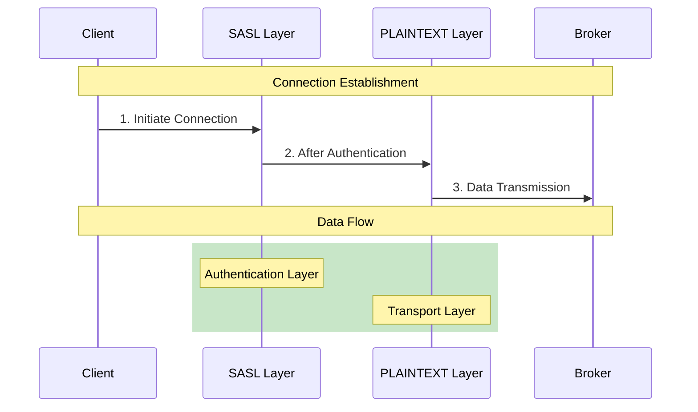

### Characteristics

1. **Authentication (SASL)**:
   - Handles user authentication
   - Supports multiple mechanisms (PLAIN, SCRAM-SHA-256, etc.)
   - Operates at the connection level

2. **Data Transport (PLAINTEXT)**:
   - No encryption of data in transit
   - Raw TCP/IP communication
   - Maximum performance (no encryption overhead)

### Configuration Examples

1. **Broker Configuration (server.properties)**:
```properties
# Enable SASL_PLAINTEXT listener
listeners=SASL_PLAINTEXT://0.0.0.0:9092
advertised.listeners=SASL_PLAINTEXT://kafka-broker:9092
security.inter.broker.protocol=SASL_PLAINTEXT

# Enable SASL mechanisms
sasl.enabled.mechanisms=PLAIN,SCRAM-SHA-256
```

2. **Client Configuration**:
```properties
# Basic SASL_PLAINTEXT setup
security.protocol=SASL_PLAINTEXT
bootstrap.servers=kafka-broker:9092

# For PLAIN mechanism
sasl.mechanism=PLAIN
sasl.jaas.config=org.apache.kafka.common.security.plain.PlainLoginModule required username="user" password="pass";

# For SCRAM-SHA-256 mechanism
sasl.mechanism=SCRAM-SHA-256
sasl.jaas.config=org.apache.kafka.common.security.scram.ScramLoginModule required username="user" password="pass";
```

### Connection Flow

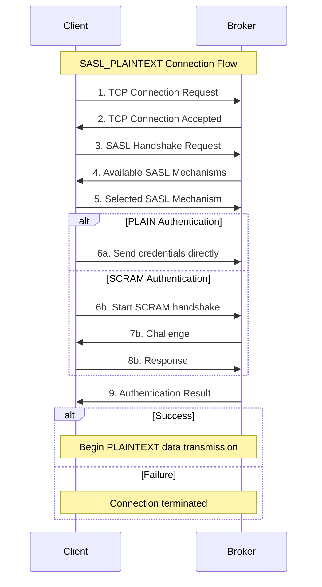

### Security Considerations

1. **Advantages**:
   - Simple to set up and configure
   - No encryption overhead
   - Good for internal, secure networks
   - Maximum performance

2. **Limitations**:
   - No data encryption
   - Credentials (in PLAIN) or challenges (in SCRAM) sent unencrypted
   - Vulnerable to network sniffing
   - Not recommended for public networks

3. **When to Use SASL_PLAINTEXT**:
   - Development environments
   - Internal, secure networks
   - When performance is critical
   - When network is already secured (VPN, private network)

4. **When to Avoid SASL_PLAINTEXT**:
   - Public networks
   - Compliance-regulated environments requiring encryption
   - When handling sensitive data
   - Cross-datacenter communication

### Best Practices

1. **Network Security**:
   - Use in private networks only
   - Implement network-level encryption (VPN)
   - Configure firewalls properly
   - Monitor network traffic

2. **Authentication**:
   - Prefer SCRAM over PLAIN when possible
   - Regularly rotate credentials
   - Use strong passwords
   - Monitor authentication failures

3. **Production Use**:
   - Consider using SASL_SSL instead
   - Implement proper ACLs
   - Regular security audits
   - Monitor broker logs

## Kafka Security Protocols Overview

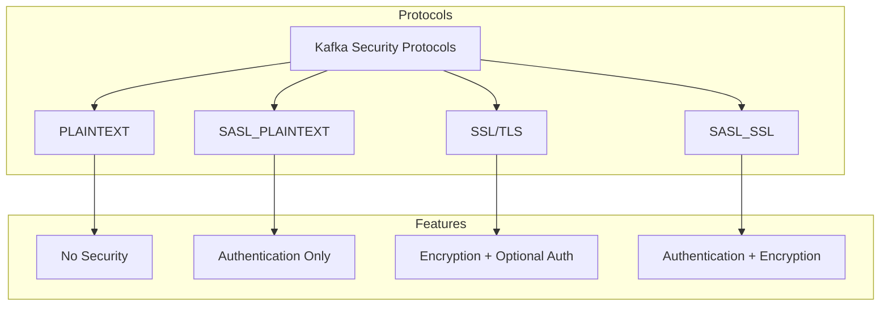

### 1. PLAINTEXT Protocol

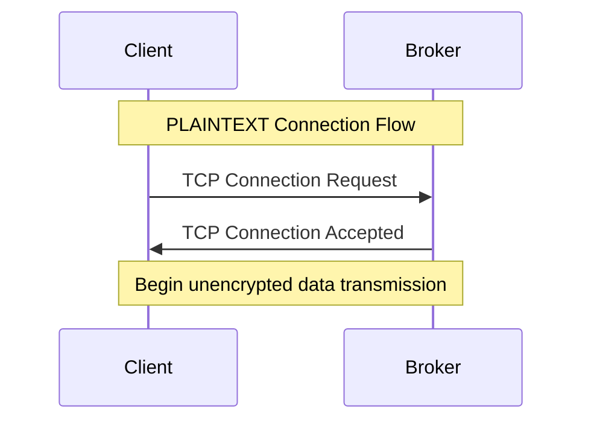

#### Characteristics:
- No security features
- No authentication
- No encryption
- Highest performance
- Suitable only for development

#### Configuration:
```properties
# Broker
listeners=PLAINTEXT://0.0.0.0:9092
advertised.listeners=PLAINTEXT://kafka-broker:9092

# Client
security.protocol=PLAINTEXT
bootstrap.servers=kafka-broker:9092
```

### 2. SSL/TLS Protocol

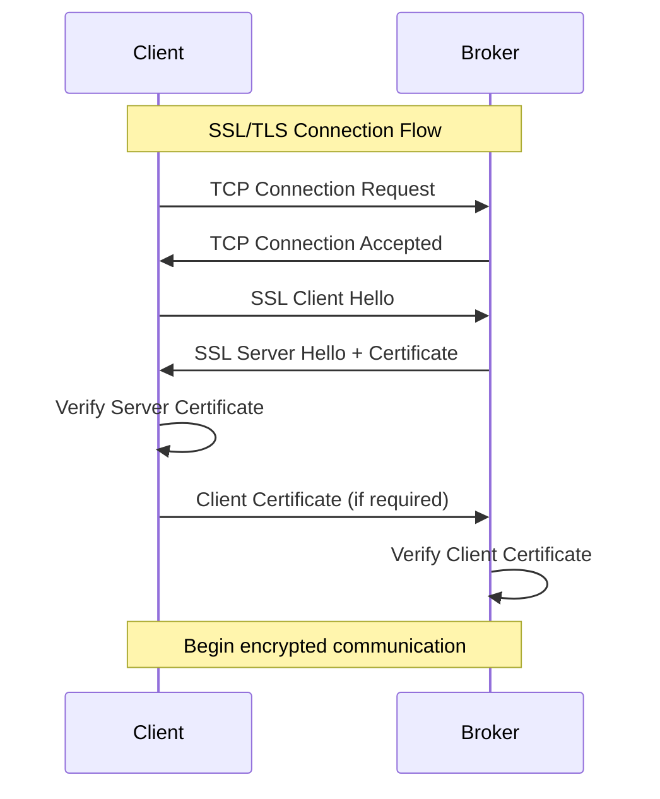

#### Characteristics:
- Encryption of data in transit
- Optional mutual TLS authentication
- Certificate-based security
- Higher CPU overhead
- Suitable for public networks

#### Configuration:
```properties
# Broker
listeners=SSL://0.0.0.0:9093
ssl.keystore.location=/path/to/kafka.server.keystore.jks
ssl.keystore.password=keystore-password
ssl.key.password=key-password
ssl.truststore.location=/path/to/kafka.server.truststore.jks
ssl.truststore.password=truststore-password
ssl.client.auth=required

# Client
security.protocol=SSL
ssl.truststore.location=/path/to/client.truststore.jks
ssl.truststore.password=truststore-password
ssl.keystore.location=/path/to/client.keystore.jks
ssl.keystore.password=keystore-password
ssl.key.password=key-password
```

### 3. SASL_SSL Protocol

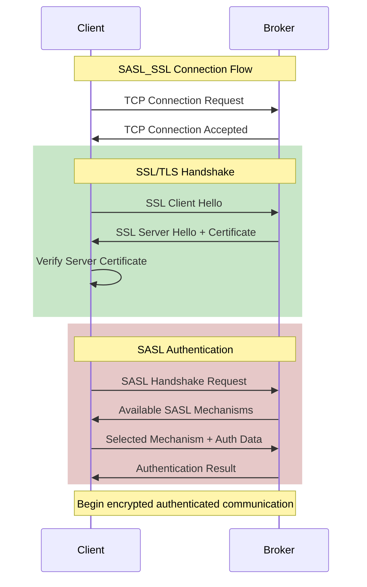

#### Characteristics:
- Combines SSL encryption with SASL authentication
- Highest security level
- Multiple authentication options
- Highest CPU overhead
- Suitable for public networks and compliance requirements

#### Configuration:
```properties
# Broker
listeners=SASL_SSL://0.0.0.0:9094
security.inter.broker.protocol=SASL_SSL
ssl.keystore.location=/path/to/kafka.server.keystore.jks
ssl.keystore.password=keystore-password
sasl.enabled.mechanisms=SCRAM-SHA-256
sasl.mechanism.inter.broker.protocol=SCRAM-SHA-256

# Client
security.protocol=SASL_SSL
sasl.mechanism=SCRAM-SHA-256
ssl.truststore.location=/path/to/client.truststore.jks
ssl.truststore.password=truststore-password
sasl.jaas.config=org.apache.kafka.common.security.scram.ScramLoginModule required \
    username="client" \
    password="client-secret";
```

### Protocol Comparison Table

| Feature | PLAINTEXT | SASL_PLAINTEXT | SSL/TLS | SASL_SSL |
|---------|-----------|----------------|---------|-----------|
| Authentication | ❌ | ✅ | Optional | ✅ |
| Encryption | ❌ | ❌ | ✅ | ✅ |
| Performance | Highest | High | Medium | Lower |
| Setup Complexity | Lowest | Medium | High | Highest |
| Security Level | None | Basic | Good | Best |
| Use Case | Development | Internal Network | Public Network | Production/Compliance |

### Protocol Selection Guide

1. **Development Environment**:
   - Use PLAINTEXT for simplicity
   - Or SASL_PLAINTEXT if testing authentication

2. **Internal Network**:
   - SASL_PLAINTEXT if network is secure
   - SSL/TLS if encryption is needed

3. **Production Environment**:
   - SASL_SSL for maximum security
   - SSL/TLS if only encryption is needed

4. **Cross-Datacenter**:
   - Always use SSL/TLS or SASL_SSL
   - Never use PLAINTEXT or SASL_PLAINTEXT

### Performance Considerations

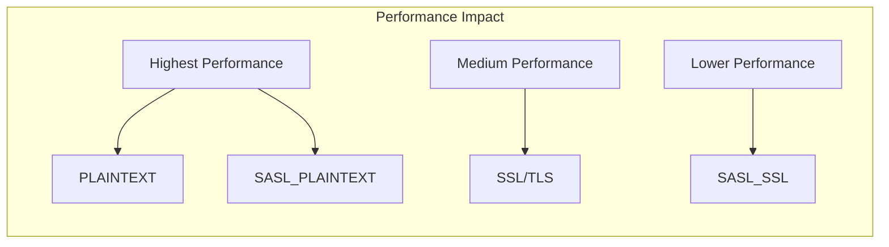

1. **CPU Usage**:
   - PLAINTEXT: Minimal
   - SASL_PLAINTEXT: Low
   - SSL/TLS: Medium to High
   - SASL_SSL: Highest

2. **Latency Impact**:
   - PLAINTEXT: None
   - SASL_PLAINTEXT: Minimal (auth only)
   - SSL/TLS: Notable (handshake + encryption)
   - SASL_SSL: Highest (auth + encryption)

3. **Network Overhead**:
   - PLAINTEXT: None
   - SASL_PLAINTEXT: Minimal
   - SSL/TLS: ~5-15%
   - SASL_SSL: ~5-15%

## Comparison Table

| Feature | PLAIN | SCRAM-SHA-256 |
|---------|-------|---------------|
| Security Level | Basic | High |
| Password Transmission | Plain text | Never transmitted |
| Setup Complexity | Simple | Moderate |
| Credential Storage | JAAS config | Zookeeper/Kafka |
| Mutual Authentication | No | Yes |
| Challenge-Response | No | Yes |
| Memory Usage | Low | Moderate |
| CPU Usage | Low | Moderate |

## Best Practices

1. **PLAIN Authentication**
   - Always use with TLS encryption in production
   - Suitable for development environments
   - Good for simple setups

2. **SCRAM-SHA-256**
   - Recommended for production environments
   - Better security with minimal performance impact
   - Requires proper credential management
   - Supports credential rotation

3. **General Security**
   - Regularly rotate passwords
   - Use strong passwords
   - Monitor authentication failures
   - Implement proper ACLs
   - Use TLS for encryption when possible

## Implementation Steps

### Setting up PLAIN Authentication
1. Configure JAAS file with usernames and passwords
2. Enable SASL_PLAINTEXT in server.properties
3. Configure client properties

### Setting up SCRAM-SHA-256
1. Enable SCRAM in server.properties
2. Create SCRAM credentials for users
3. Configure client properties
4. Test authentication

## Monitoring and Troubleshooting

### Common Issues
1. Authentication failures
2. Misconfigured JAAS
3. Wrong mechanism specified
4. Network connectivity issues

### Monitoring Metrics
- Failed authentication attempts
- Successful logins
- Authentication latency
- Connection rates
