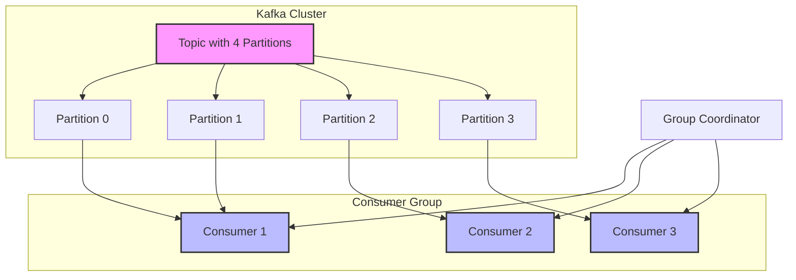
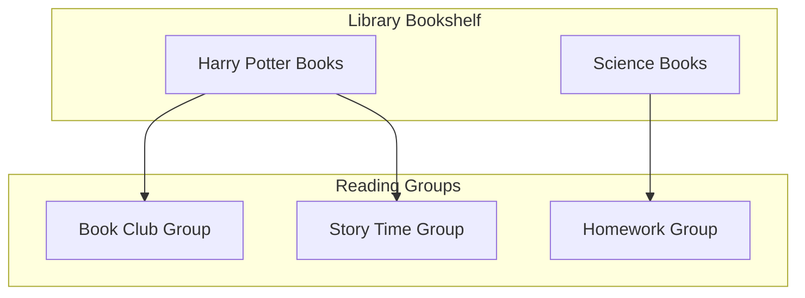
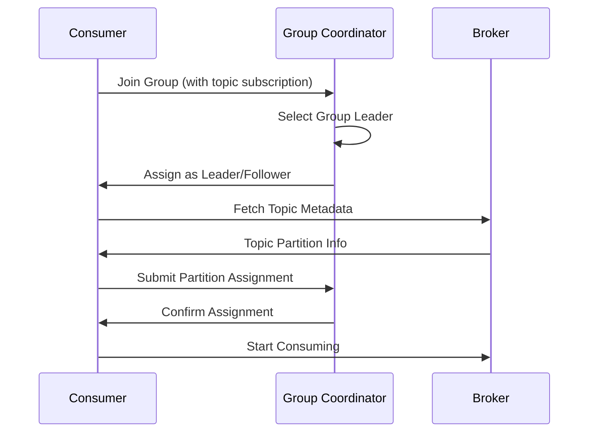
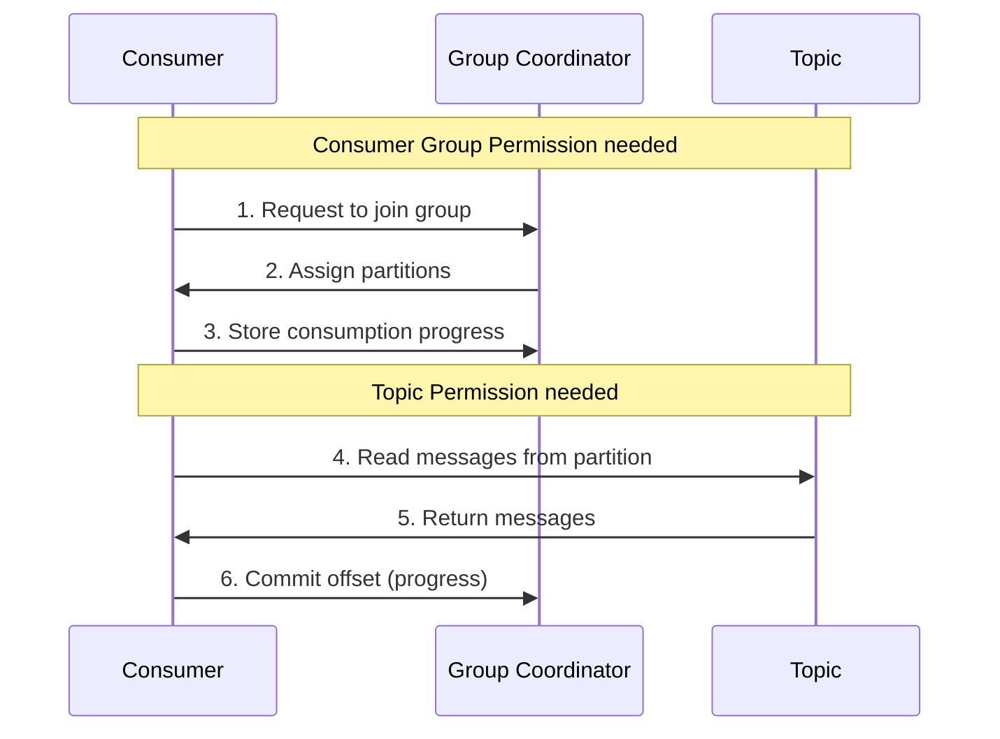

# Understanding Kafka Consumer Groups

## What is a Consumer Group?
A consumer group is a set of consumers that work together to consume messages from one or more Kafka topics. The key benefit is automatic workload balancing and fault tolerance.

## Key Concepts
- Each consumer in a group reads from exclusive partitions
- Kafka automatically handles partition rebalancing when consumers join or leave the group
- If there are more consumers than partitions, some consumers will be idle
- If a consumer fails, its partitions are redistributed to other consumers in the group

## Consumer Group Flow Diagram



## How Consumer Groups Work

1. **Group Formation**:
   - When a consumer starts, it joins the group by contacting the group coordinator
   - The group coordinator is one of Kafka's brokers

2. **Partition Assignment**:
   - The group coordinator selects one consumer as the group leader
   - The leader assigns partitions to group members
   - Each consumer gets exclusive access to its assigned partitions

3. **Rebalancing**:
   - Triggered when consumers join/leave the group
   - When a consumer fails (detected via missed heartbeats)
   - When new partitions are added to a topic

4. **Consumption Process**:
   - Each consumer reads from its assigned partitions
   - Tracks its offset (position) in each partition
   - Commits offsets regularly to maintain progress

## Understanding Kafka with a Library Example 📚

Imagine a big library with many books (these are like Kafka topics). Now, let's see how it works:

### The Library Setup
- The library has many bookshelves (topics)
- Each bookshelf has different sections (partitions)
- There are reading groups (consumer groups) that want to read books

### Example: School Reading Groups



#### How It Works:

1. **Library Card (Topic Permission)**
   - Like a library card that lets you borrow books
   - Without it, you can't take any books from the shelves
   - This is like having permission to read from a Kafka topic

2. **Reading Group Membership (Consumer Group Permission)**
   - Like being registered in a reading group
   - The group leader assigns different chapters to each member
   - Everyone keeps track of what pages they've read
   - This is like being in a Kafka consumer group

#### Real Example:
Imagine three friends in the Book Club Group reading "Harry Potter":
- Sarah reads chapters 1-3
- Mike reads chapters 4-6
- Emma reads chapters 7-9

Just like:
- If Sarah finishes early, she can help read Mike's chapters
- If Mike is sick, Sarah and Emma can split his chapters
- They use bookmarks to remember where they stopped
- They don't need to read the same chapters as the Story Time Group

This is exactly how Kafka consumers work:
- Books = Messages in topics
- Reading Groups = Consumer groups
- Chapters = Partitions
- Bookmarks = Offsets
- Library Card = Topic permissions
- Group Registration = Consumer group permissions

Remember: Just like you need both a library card AND group registration to participate in a reading group, Kafka consumers need both topic AND consumer group permissions to work properly!

## Topic Subscription in Consumer Groups

### How Consumers Subscribe to Topics

1. **Explicit Topic Subscription**:
   - Consumers can explicitly subscribe to specific topics using topic names
   - Example: `consumer.subscribe(['topic1', 'topic2'])`
   - Can use regex patterns to subscribe to topics matching a pattern
   - Example: `consumer.subscribe(pattern='^order.*')`

2. **Dynamic Topic Management**:
   - Consumers can dynamically subscribe/unsubscribe to topics
   - Group rebalancing occurs when subscription changes
   - All consumers in a group must subscribe to the same topics

3. **Partition Assignment Strategy**:
   - RangeAssignor: Assigns partitions on a per-topic basis
   - RoundRobinAssignor: Assigns all partitions across all subscribed topics
   - StickyAssignor: Minimizes partition movement during rebalancing
   - CooperativeStickyAssignor: Allows incremental rebalancing

4. **Topic Configuration Considerations**:
   - Number of partitions affects maximum parallelism
   - Topic retention policies impact consumer group offset management
   - Topic replication factor affects reliability

### Example Topic Subscription Flow:



## Topic and Consumer Group Relationship

### Key Points About Topic-Group Relationships

1. **Many-to-Many Relationship**:
   - One topic can be consumed by multiple consumer groups
   - One consumer group can consume from multiple topics
   - There is no fixed ownership between topics and groups

2. **Dynamic Subscription**:
   ```mermaid
   graph TD
       T1[Topic A] --> G1[Consumer Group 1]
       T1[Topic A] --> G2[Consumer Group 2]
       T2[Topic B] --> G1[Consumer Group 1]
       T2[Topic B] --> G3[Consumer Group 3]
   ```
   - Each consumer group independently subscribes to topics
   - Different consumer groups can process the same messages for different purposes
   - Each group maintains its own offset tracking per topic-partition

3. **Use Case Examples**:
   - Group 1: Processes orders for shipping
   - Group 2: Processes same orders for analytics
   - Group 3: Processes same orders for audit logging
   
4. **Independent Processing**:
   - Each consumer group processes messages independently
   - Groups don't interfere with each other's consumption
   - Each group maintains its own offset tracking
   - Messages aren't "removed" when read - they remain available for other groups

## Why Two Different Permissions Are Needed



### Example Scenarios:

1. **With Topic Permission Only**:
   - Can read messages directly (if you know the partition)
   - BUT cannot:
     * Coordinate with other consumers
     * Track reading progress
     * Handle failovers automatically

2. **With Consumer Group Permission Only**:
   - Can join a consumer group
   - Can participate in rebalancing
   - BUT cannot actually read any messages

3. **With Both Permissions**:
   - Full consumer group functionality
   - Automatic workload balancing
   - Fault tolerance
   - Progress tracking
   - Scalable consumption

This is why both permissions are essential for proper consumer operation in a distributed system.

## Benefits of Consumer Groups

1. **Scalability**: Easy to scale processing by adding more consumers
2. **High Availability**: Automatic failover if a consumer dies
3. **Load Balancing**: Work is distributed evenly across consumers
4. **Parallel Processing**: Multiple consumers can process data simultaneously

## Best Practices

1. **Number of Consumers**: 
   - Should be <= number of partitions
   - Extra consumers will remain idle

2. **Partition Count**:
   - Should be >= expected number of consumers
   - Enables scalability

3. **Consumer Monitoring**:
   - Monitor consumer lag
   - Watch for frequent rebalancing
   - Track offset commit patterns

4. **Group ID**:
   - Use meaningful group IDs
   - Different applications should use different group IDs
